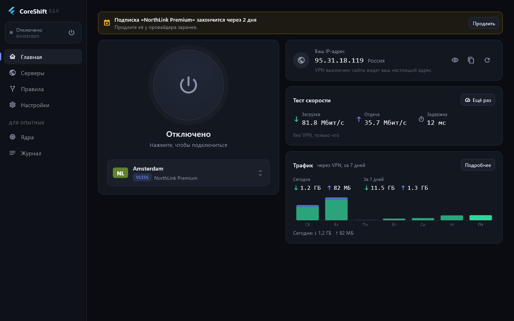
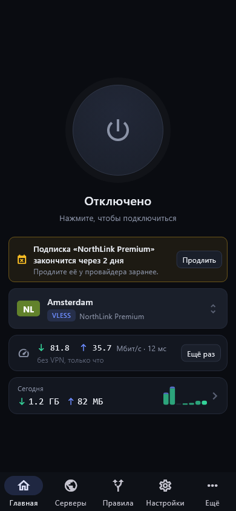
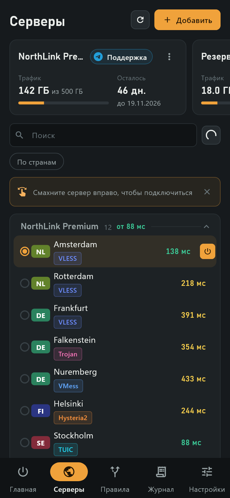
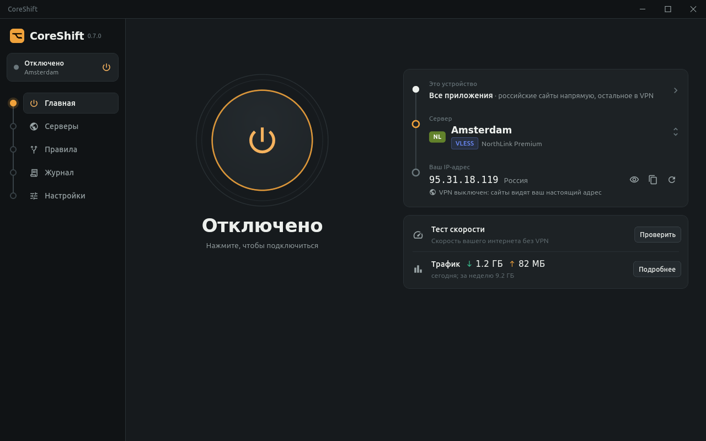

<div align="center">

# CoreShift

**VPN-клиент для Windows, Linux и Android, который сам держит соединение.**
Вставили подписку, нажали одну кнопку, дальше CoreShift всё делает сам.

[](https://github.com/NezZeen/CoreShift-Release/releases/latest/download/CoreShift-Setup.exe)
[](#linux)
[](https://github.com/NezZeen/CoreShift-Release/releases/latest/download/CoreShift.apk)

[](https://github.com/NezZeen/CoreShift-Release/releases/latest)
[](https://github.com/NezZeen/CoreShift-Release/releases)
[](https://t.me/CoreShift_app)



</div>

## Почему CoreShift

**🔁 Три ядра вместо одного.** Внутри сразу Xray, sing-box и mihomo. Если ядро упало, не принимает конфиг или перестало пропускать трафик, CoreShift сам переключается на следующее, и интернет не пропадает. Когда основное ядро снова в порядке, CoreShift может вернуться на него сам.

**🛡 Обход блокировок (DPI).** Одним переключателем CoreShift режет начало защищённого соединения на части, и фильтры провайдера перестают его узнавать.

**⚡ Сам находит быстрый сервер.** CoreShift замеряет пинг до всех серверов и одной кнопкой подключается к самому быстрому. Серверы, которые не отвечают на обычный пинг, он проверяет настоящим запросом через ядро: так видно, работает ли сервер на самом деле.

**🧩 Подписка добавляется как удобно:**
- кнопкой «Добавить в CoreShift» на странице подписки панели (ссылка `coreshift://`);
- из буфера обмена: скопировали ссылку, открыли CoreShift, он сам предложит её добавить. Подходят и ссылки для Happ, v2rayNG, v2RayTun, Hiddify, Clash, sing-box и других клиентов;
- по QR-коду: показали подписку на ПК, отсканировали телефоном.

Перед добавлением CoreShift спрашивает подтверждение и не показывает ключ из ссылки.

**🗂 Все форматы подписок.** Поддерживаются ссылки `https://…`, списки серверов VLESS (Reality, XHTTP, gRPC…), VMess, Trojan, Shadowsocks, Hysteria2, TUIC, AnyTLS, WireGuard, а также JSON Xray (например, от Remnawave) и конфиги Clash.

**🎮 Hysteria2 для игр и звонков.** Быстрый протокол поверх UDP с минимальной задержкой, в том числе в подписках Remnawave. CoreShift сам запускает его на ядре, которое его поддерживает.

**🚦 Гибкие правила.** Можно выбрать, что идёт через VPN:
- всё, кроме исключений, или только выбранное;
- российские сайты напрямую одним переключателем, при этом Google и YouTube всегда идут через VPN;
- готовые наборы популярных сервисов в один клик;
- свои сайты: через VPN, мимо VPN или заблокировать совсем;
- отдельные программы на Windows (игры, торренты, банки) и приложения на Android — через VPN или мимо него.

**🔒 Без утечек.** CoreShift перехватывает DNS и может блокировать DNS-over-TLS, а с выключенным IPv6 не выпускает его мимо VPN. Встроенная проверка показывает, видят ли сайты ваш настоящий DNS. Службой на Windows пользуются только свои учётные записи, а подписки на Android не уходят в резервные копии.

**⏰ Напомнит продлить подписку.** За несколько дней до конца срока и при 90% трафика на главной появится предупреждение с кнопкой «Продлить» и придёт уведомление.

**📊 Всё видно.** На главной ваш IP-адрес и страна, трафик за неделю, тест скорости через speedtest.net (загрузка, отдача и задержка, ближайший сервер теста) через VPN или без него.

**🧭 Сам разбирается, что сломалось.** Если сервер перестал отвечать, CoreShift отличает это от пропавшего интернета, сам переходит на живой сервер подписки и говорит, какой сервер не отвечает. Если пропала сама сеть, CoreShift пишет «Нет сети», ждёт её и продолжает работу, когда она вернётся. Локальная сеть — роутер, принтеры, виртуальные машины — работает и при включённом VPN. Кнопка «Поддержка» ведёт в чат провайдера, если он его указал.

**🔄 Обновляется сам.** Обновления подписаны и проверяются перед установкой. На ПК обновление ставится, когда VPN выключен, и не рвёт соединение. Ядра тоже обновляются сами, без кнопок.

**🎛 Ничего лишнего.** Пять вкладок, одинаковых на ПК и телефоне: Главная, Серверы, Правила, Журнал, Настройки. Тонкие настройки спрятаны в «Дополнительно», а защита от утечек DNS включается одним переключателем.

**🌗 Тёмная и светлая темы**, автоподключение при запуске, свёртывание в трей.

<div align="center">

&nbsp;&nbsp;

</div>

## Установка

| Система | Скачать |
|---|---|
| Windows 10 и 11 (64-bit) | [CoreShift-Setup.exe](https://github.com/NezZeen/CoreShift-Release/releases/latest/download/CoreShift-Setup.exe) |
| Linux (64-bit) | пакеты для Debian/Ubuntu, Fedora/openSUSE, Arch и архив для остальных — [ниже](#linux) |
| Android 7 и новее (64-bit ARM) | [CoreShift.apk](https://github.com/NezZeen/CoreShift-Release/releases/latest/download/CoreShift.apk) |

1. Скачайте файл для своей системы и установите его. На Android система попросит разрешить установку из браузера или файлового менеджера.
2. Добавьте подписку: кнопкой на странице подписки, из буфера обмена, по QR-коду или вставив ссылку вручную.
3. Нажмите кнопку подключения.

Все версии и что в них нового — на странице [Releases](https://github.com/NezZeen/CoreShift-Release/releases).

## Чат

Новости, вопросы и помощь с настройкой — в Telegram: [t.me/CoreShift_app](https://t.me/CoreShift_app).

## Linux

| Система | Пакет | Установка |
|---|---|---|
| Debian, Ubuntu, Mint, Pop!_OS | [CoreShift-amd64.deb](https://github.com/NezZeen/CoreShift-Release/releases/latest/download/CoreShift-amd64.deb) | `sudo apt install ./CoreShift-amd64.deb` |
| Fedora, RHEL, Alma, Rocky, openSUSE | [CoreShift-x86_64.rpm](https://github.com/NezZeen/CoreShift-Release/releases/latest/download/CoreShift-x86_64.rpm) | `sudo dnf install ./CoreShift-x86_64.rpm` или `sudo zypper install ./CoreShift-x86_64.rpm` |
| Arch, Manjaro, EndeavourOS | [CoreShift-x86_64.pkg.tar.zst](https://github.com/NezZeen/CoreShift-Release/releases/latest/download/CoreShift-x86_64.pkg.tar.zst) | `sudo pacman -U CoreShift-x86_64.pkg.tar.zst` |
| Другие дистрибутивы | [CoreShift-linux-amd64.tar.gz](https://github.com/NezZeen/CoreShift-Release/releases/latest/download/CoreShift-linux-amd64.tar.gz) | распаковать и запустить `sudo ./install.sh` |



После установки выйдите из системы и войдите снова: так у вашего пользователя появится доступ к службе CoreShift. VPN работает через системную службу и не выключается, когда закрыто окно. Обновления на Linux ставятся новым пакетом: CoreShift сам сообщит, когда выйдет новая версия.

Проверено на Ubuntu 24.04, Debian 13, Fedora 44, openSUSE Tumbleweed и Arch, на рабочем столе KDE Plasma (X11 и Wayland). В GNOME для значка в трее нужно расширение AppIndicator. Alpine и Void (OpenRC, runit) поддерживаются архивом `.tar.gz`, но пока не проверены на живой системе. Сборка для ARM64 появится позже.

## Для владельцев панелей

Чтобы на странице подписки (Remnawave и других) появилась кнопка «Добавить в CoreShift», используйте схему:

```
coreshift://add/<ссылка на подписку>
```

Для Remnawave в конфиге страницы подписки:
- `"urlScheme": "coreshift://add/"`;
- ссылка на скачивание для Windows: `https://github.com/NezZeen/CoreShift-Release/releases/latest/download/CoreShift-Setup.exe`;
- ссылка на скачивание для Android: `https://github.com/NezZeen/CoreShift-Release/releases/latest/download/CoreShift.apk`.

Обе ссылки на скачивание всегда ведут на последнюю версию.
